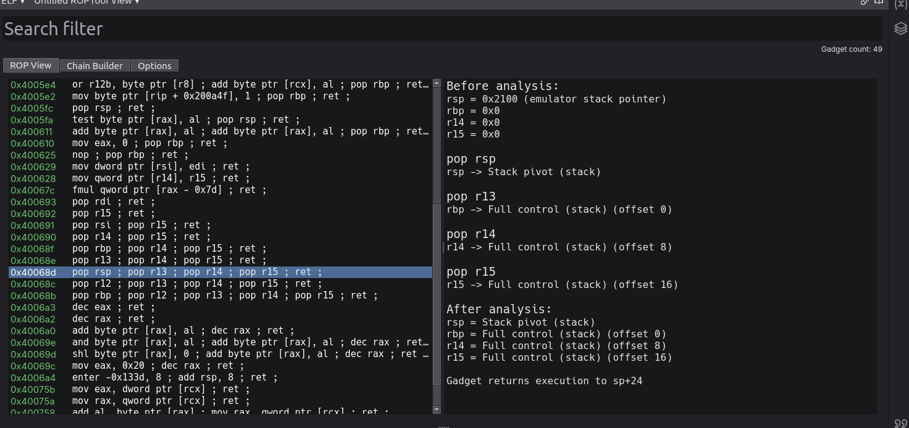
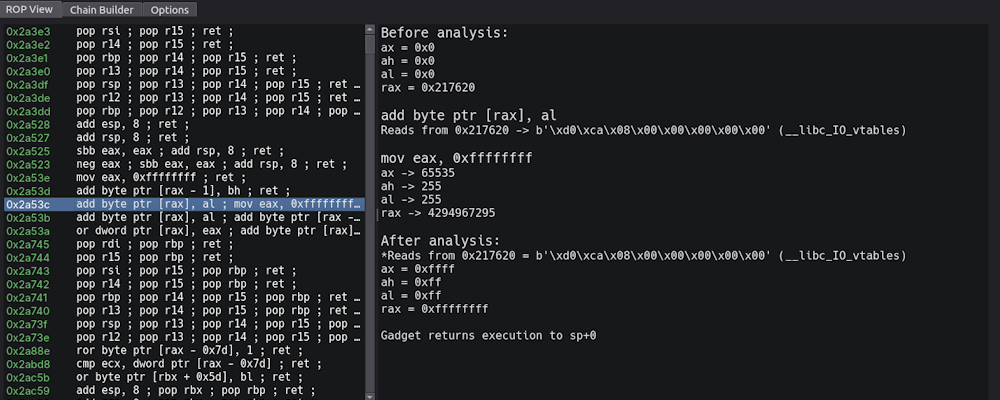
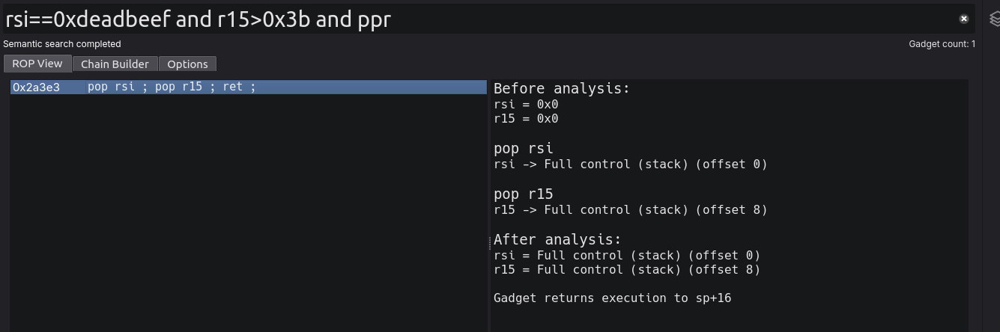
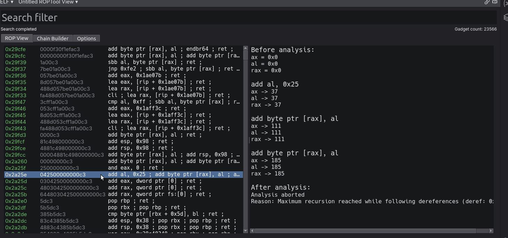

# RopView - Gadget Analysis Framework

   

RopView is a gadget analysis framework for BinaryNinja capable of granular per-instruction based analysis and complex logical queries.

# Features
## Gadget Search
Gadget searching and pooling is fully integrated into the BinaryView and takes advantage of the currently loaded session for quick discovery and caching, making it faster than many similar ROP tools. Additionally, the usual options are available to configure the search settings and constrain the gadget pool appropriately.

## Gadget Analysis
In the right pane, an analysis is shown of the currently selected gadget in the pool. This pane details the effects of the gadget on memory locations, clobbered registers, and accesses made to the stack or other memory regions. The analysis shows a start state, intermediary step states, and an end state. The analysis framework takes advantage of [unicorn engine](https://www.unicorn-engine.org/) and can return a report instantly. This is done using different hooks to add analysis and diffing functionality inbetween the fetch-execute cycle and resolve fetched mappings from the target binary into the analysis context in realtime as requested. Gadget contexts are cached for later use and attributes are added to the search engine as queryable columns, allowing for semantic based searches. The memory context before analysis is also tunable. In options, one can define register values for a prestate before emulation of the gadget occurs. In the future, I plan to add functionality to allow for prestate populating based on imported corefiles and attaching to the BinaryNinja debugger.

## Semantic and Hueristic-based Searching
During the gadget searching and analysis process, gadgets are cached for later access in addition to being added to Dataframe columns for fast, data-driven search queries. The search filter takes advantage of [pandas](https://pandas.pydata.org/), a data-analysis library that allows for collective and aggregated data analysis. This allows RopView to query advanced logical statements on specific gadget attributes (inst_cnt, bytes, disasm, etc) with metadata (count, contains, etc). The result is much more capable gadget search engine in comparison to other frameworks. Included in these queryable attributes are end-state register values derived from a gadget's corresponding analysis, which allows for effect-based semantic searching. Pre-defined presets are also included (currently `ppr`, `stack_pivot`, `execve`, and `jmp_reg`) but because these presets are simply translated to specific panda quieres, I plan to add custom presets as a feature in the future. Additionally, the entire gadget pool dataframe can be exported to a csv for later data analysis.

# Maintenance and Development
This plugin is actively maintained and development is on-going although updates may be infrequent due to my busy schedule. Currently the following milestones are planned:
- Support for ARM and MIPS
	- Additional search options for each (ie: li a0, tail, double jump searches for MIPS)
- Tunable analysis prestates
	- Based on coredump
	- Based on debugging session
- Chain builder
	- Add gadgets to builder and export to pre-defined or custom presets

# Dependencies
RopView relies on the following dependencies for its core functionality
- [Unicorn CPU Emulator](https://www.unicorn-engine.org/)
- [Keystone Assembler](https://www.keystone-engine.org/)
- [Capstone Disassembler](http://www.capstone-engine.org/)
- [pandas](https://pandas.pydata.org/)
- [Pyside6 QT (BinaryNinja's UI framework)](https://www.qt.io/qt-for-python)

# Demo
Analysis and example search (semantic)

# Contributions
Contributions are welcome! Please open an issue if you encounter a bug.

# Pre-release notes
I am waiting on finishing the post for my technical blog and other miscellaneous activities before creating a release tag and opening an issue to add to community-plugins. In the meantime, install by git cloning this repo into `~/.binaryninja/plugins`
