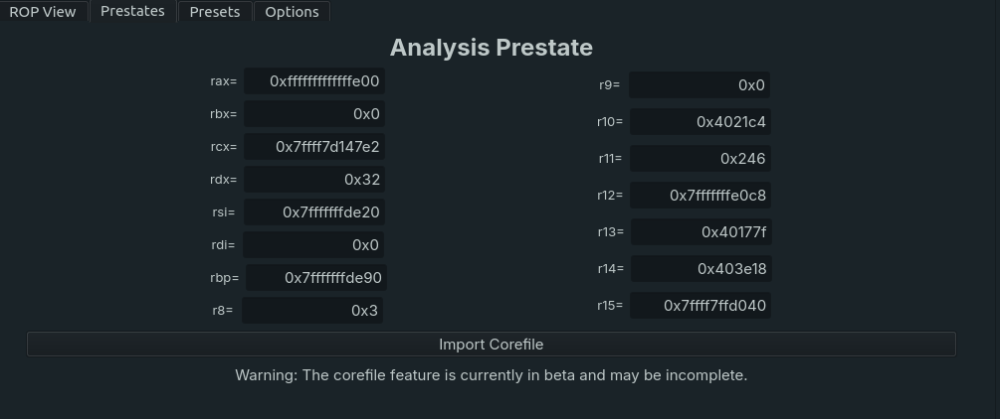

# RopView - Gadget Analysis Framework

   

RopView is a gadget analysis framework for BinaryNinja capable of granular per-instruction based analysis backed by [Unicorn Engine](https://www.unicorn-engine.org/) and complex logical queries backed by [pandas](https://pandas.pydata.org/).

# Features
## Gadget Search
Gadget searching and pooling is fully integrated into the BinaryView and takes advantage of the currently loaded session for quick discovery and caching, making it faster than many similar ROP tools. Additionally, the usual options are available to configure the search settings and constrain the gadget pool appropriately. For a detailed technical explanation, refer to [this post](https://faultpoint.com/post/2024-06-02-binja-plugin-ropview/).

## Gadget Analysis
In the right pane, an analysis is shown of the currently selected gadget in the pool. This pane details the effects of the gadget on memory locations, clobbered registers, and accesses made to the stack or other memory regions. The analysis shows a start state, intermediary step states, and an end state. The analysis framework takes advantage of [unicorn engine](https://www.unicorn-engine.org/) and can return a report instantly. Internally, this is done using different hooks to add analysis and diffing functionality in the fetch-execute cycle. Furthermore, access violations are hooked to resolve fetched mappings from the target binary into the analysis context in realtime as they are requested. Gadget states are cached for later use and attributes are added to the search engine as queryable columns, allowing for semantic and effect based searches.

## Semantic and Hueristic-based Searching
During the gadget searching and analysis process, gadgets are cached for later access in addition to being added to Dataframe columns for fast, data-driven search queries. The search filter takes advantage of [pandas](https://pandas.pydata.org/), a data-analysis library that allows for collective and aggregated data analysis. This allows RopView to query advanced logical statements on specific gadget attributes (inst_cnt, bytes, disasm, etc) with metadata (count, contains, etc). The result is a much more capable gadget search engine in comparison to other frameworks. Included in these queryable attributes are end-state register values derived from a gadget's corresponding analysis state, which allows for effect-based semantic searching. Additionally, the entire gadget pool dataframe can be exported to a csv for later data analysis in options. Searchable objects are capable of processing whatever may be an attribute of its relative `Series` object and most options can include regex. Default search behavior searches for mnemonic matches in disasm.

Currently queryable objects include:
- addr (int)
- loc (str)
- bytes (str)
- inst_cnt (int)
- disasm (str)
- registers (int)

## Presets
Presets allow the user to specify dictionary translations for specific keywords into pandas/semantic search queries. Custom presets are saved to the BinaryView along with the rest of the cache. Each architecture is already defined with a set of architecture-tied presets.

## Prestates
Prestates allow one to specify register-context before analysis. These take the place of individually definable registers, as well as a coredump import feature. Importing a coredump will add its register context and include available memory mappings from the corefile in analysis context for possible resolving.

# Architecture Support
ROPView currently supports the following architectures:
- i386
- amd64
- armv7
- aarch64
- thumb2 (toggle)
- mipsel32
- mipsel64
- mips32
- mips64

# Dependencies
RopView relies on the following dependencies for its core functionality
- [Unicorn CPU Emulator (GadgetAnalysis)](https://www.unicorn-engine.org/)
- [Capstone Disassembler (GadgetSearch, GadgetAnalysis)](http://www.capstone-engine.org/)
- [pandas (SearchFilter)](https://pandas.pydata.org/)
- [Pyside6 QT (BinaryNinja's UI framework)](https://www.qt.io/qt-for-python)
- [lief (Corefile)](https://lief.re/)

# Demo Gallery

- sleep_a0

- execve

- Address range is > 0x1000 and is ASCII constrained (excluding first byte)

# Contributions
Contributions are welcome! Please open an issue if you encounter a bug. PRs are reviewed periodically. Please reach me on my blog is needed: https://faultpoint.com

# Installation
Install this plugin by cloning this repo directly into `~/.binaryninja/plugins`
